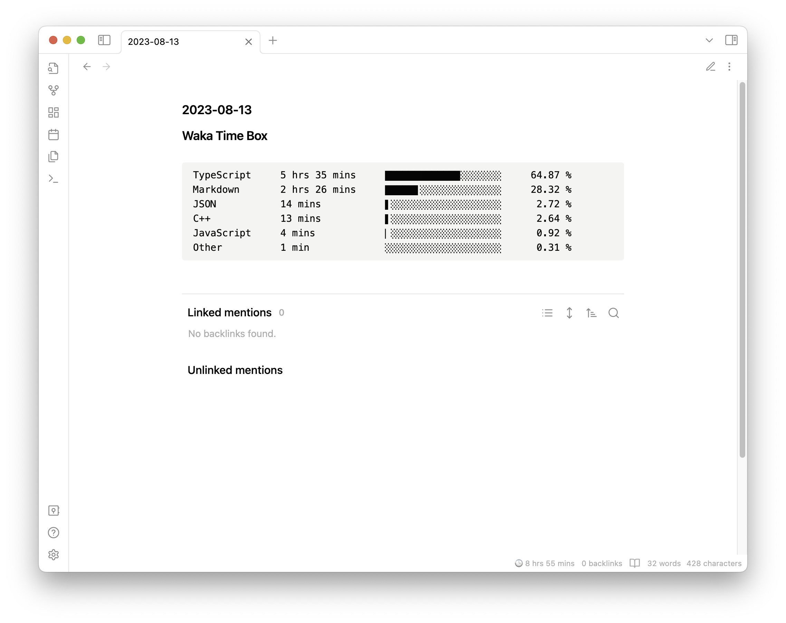
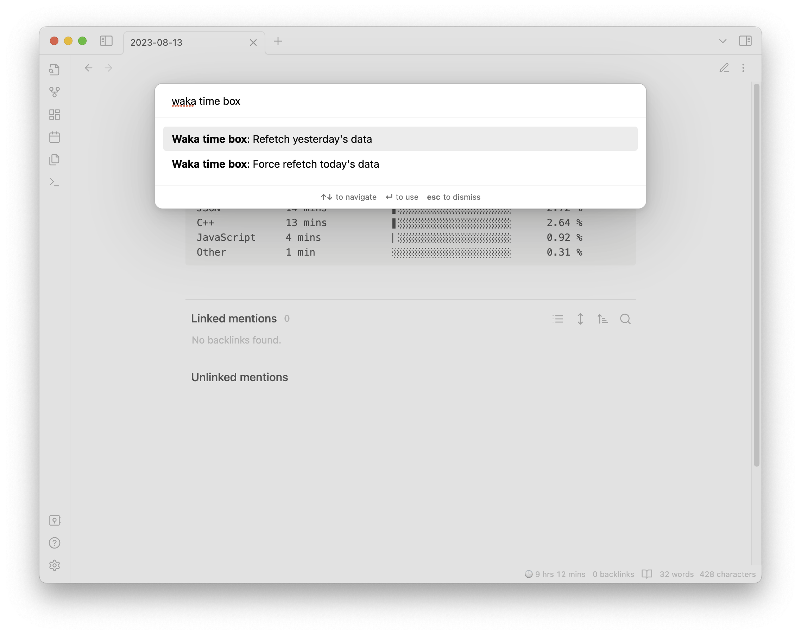

# Obsidian WakaTime Box

## READ BEFORE USING !

This extension has been made by @simonla. (https://github.com/simonla/obsidian_waka_box).

I only added the possibility of custom api URL in case of using self-hosted wakatime server.

I did that in 10 minutes so many bugs could happen, if you do not use a custom wakatime server, please use the [original extension](https://github.com/simonla/obsidian_waka_box) !

---

Show your [WakaTime](https://wakatime.com/) stats in your Obsidian daily notes.

By default, it will fetch periodically every hour, but you can force a refresh from the command palette.

This plugin will insert the stats at the top of the daily note. But if it's existing, it will refresh the stats instead of inserting a new one. You can use this behavior to customize where to insert the stats in your daily note.
